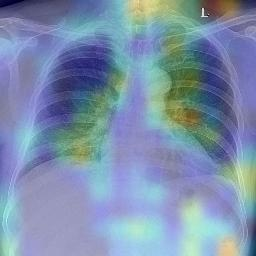
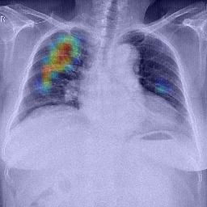

# Class Activation Maps
***
A technique for making Convolutional Neural Network (CNN)-based models more transparent by visualizing the regions of input that are “important” for predictions from these models — or visual explanations.

## [View apresentation](lectures/activation-class-map.pdf)

## Examples using images of VinBigData and the Inception architecture

|||
|-|-|
|||
|||

