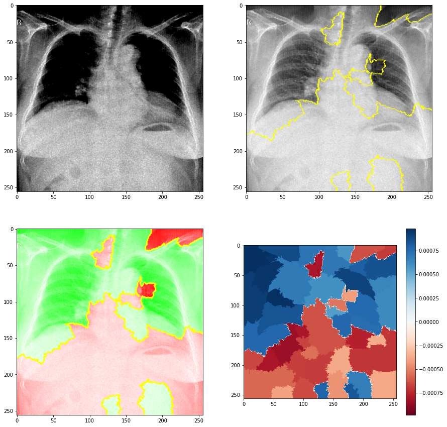

# Class Activation Maps
***
A technique for making Convolutional Neural Network (CNN)-based models more transparent by visualizing the regions of input that are “important” for predictions from these models — or visual explanations.

Graphical visualization algorithms for convolutional neural networks are useful to understand what the layers of convolution are giving more prominence in digital images. Particularly in the medical field, these methods prove to be effective to validate the effectiveness of the models created, since they need to be well designed. In view of these observations, two algorithms have been shown to be relevant for these purposes, they are:

- [Grad CAM](https://github.com/Alyssonmach/class-activation-maps/blob/main/lectures/1-activation-class-map.pdf)
- [LIME](https://github.com/Alyssonmach/class-activation-maps/blob/main/lectures/2-lime-algorithm.pdf)

For further clarification, the slides above guarantee theoretical explanations about the two algorithms.

### Sample images from Grad CAM
***

|||
|-|-|
|||
|||

### Examples of LIME images
***

